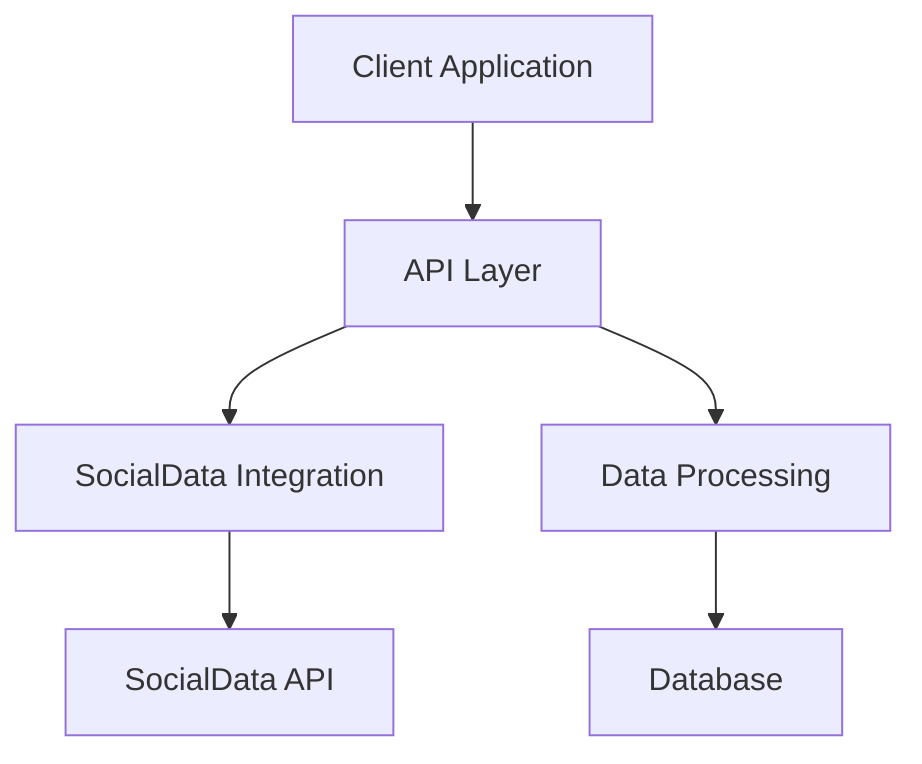
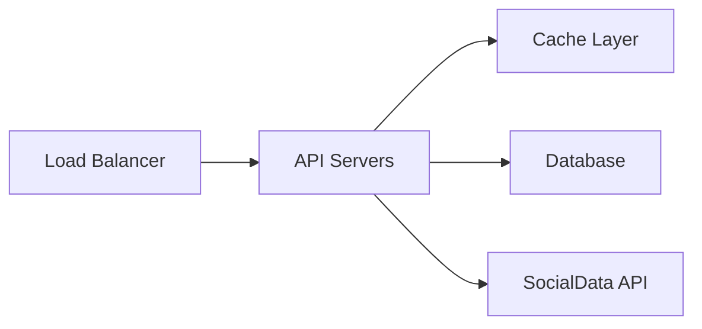

# Project Architecture

This document provides an overview of the project's architecture, including how different components interact and how external services like SocialData API are integrated.

## System Overview

## Components

### 1. API Layer
- REST endpoints
- Request validation
- Authentication & Authorization
- Rate limiting

### 2. SocialData Integration
- API client configuration
- Response handling
- Error management
- Rate limit handling
- See: [SocialData Implementation Guide](implementation/socialdata-implementation.md)

### 3. Data Processing
- Tweet analysis
- User data processing
- Content filtering
- Data aggregation

### 4. Storage
- Data models
- Caching strategy
- Backup procedures

## Integration Points

### External Services
- SocialData API
- Authentication services
- Monitoring services

### Internal Systems
- Logging system
- Monitoring
- Analytics

## Deployment Architecture

## Security Considerations
- API key management
- Data encryption
- Access control
- Rate limiting

## Performance Considerations
- Caching strategy
- Request optimization
- Resource scaling

## Future Improvements
- [ ] Implement advanced caching
- [ ] Add real-time processing
- [ ] Enhance monitoring

---
Note: This is a living document that should be updated as the architecture evolves. 